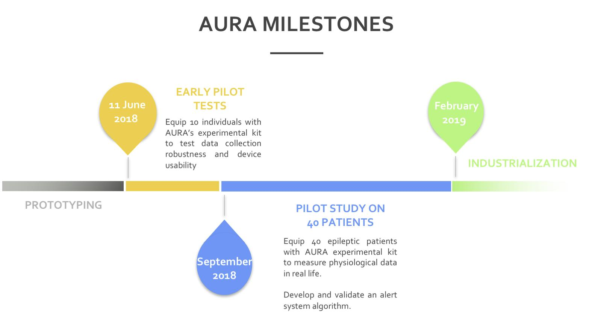
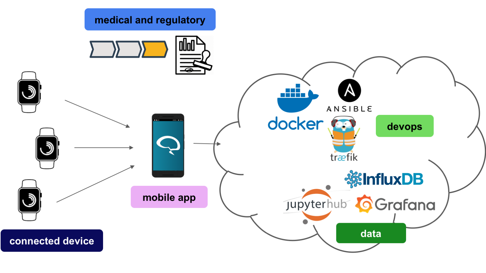

# How to contribute

:+1::tada: First off, thanks for taking the time to contribute! :tada::+1:

The following is a set of guidelines for contributing to AURA, which are hosted in the [AURA Organization](https://github.com/Aura-healthcare) on GitHub. These are mostly guidelines, not rules. Use your best judgment, and feel free to propose changes to this document in a pull request.
We want you working on things you're excited about and respect the [Code Of Conduct](https://github.com/Aura-healthcare/Aura_mobile_app/blob/master/code-of-conduct.md)

Here are some important resources:

  * [AURA website](http://www.aura.healthcare) tells you who and where we are, and
  * [AURA Gitbook](https://github.com/Aura-healthcare/Aura_gitbook) , give you acces to the technical documentation
  * [AURA Current Sprint](https://github.com/Aura-healthcare/Aura_gitbook/projects/1) is our day-to-day project management plan for the incomming two weeks
  * [AURA Global pilot study](https://github.com/Aura-healthcare/Aura_gitbook/projects/2) is an overview of what's needed for the MVP prototype to start the pilot study on 40 patients.
  * For sharing state of the art technology and be part of passionate discussions on healthcare future, Feel free to join us on [Slack !](https://join.slack.com/t/associationaura/shared_invite/enQtMzczOTAwNjkzMTIwLTc0MjFmOWNhM2E0NzMyNGY3MjBlMTU5YWQ0NmRhZDVkZWZlNjNiMmJjMTU1YTY2NWZkMWVjYTVkMDdlZTJhYjI)
  * Found BUGS? [Github issues](https://github.com/Aura-healthcare/Aura_gitbook/issues) is where to report them

## An overview of the project

As much as possible we try to write issues and user stories so that they match the flags of the diagram above
## Testing

Travis CI is running after every commits and we have an overview of the code coverage using CodeCov.

## Submitting changes

Please send a GitHub Pull Request to AURA mobile app with a clear list of what you've done (read more about [pull requests](http://help.github.com/pull-requests/)). When you send a pull request, we will love you forever if you include associated unit tests. We can always use more test coverage.

Always write a clear log message for your commits. One-line messages are fine for small changes, but bigger changes should look like this:

    $ git commit -m "A brief summary of the commit
    >
    > A paragraph describing what changed and its impact."
