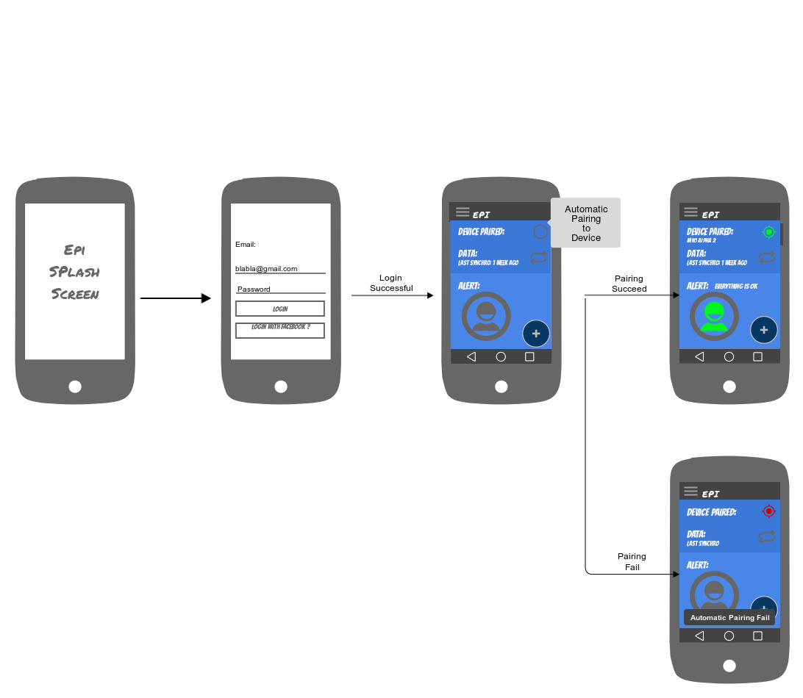
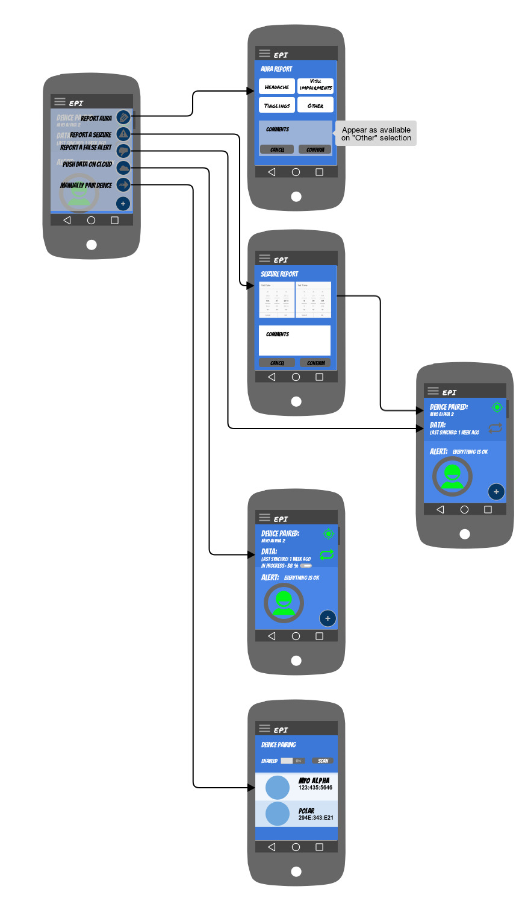
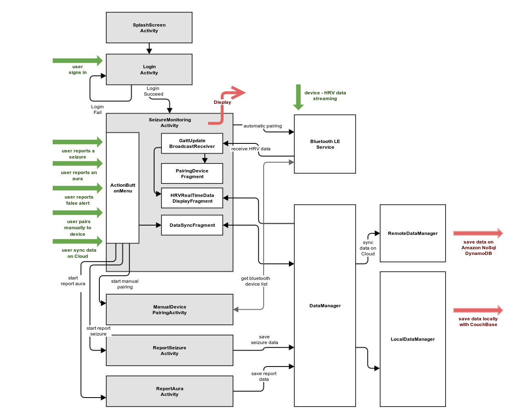

# Headline #
The "Aura Project" app will alert an user from an epilepsy seizure within few minutes notice 

# Pre-requisites #
1. AndroidSdk version 23.0
2. Connected device transfering HRV data through Heart Rate bluetooth profile 

# References #
Bluetooth Low Energy pairing module is is based on AndroidBluetoothLEGatt Sample
[link](https://developer.android.com/reference/android/bluetooth/BluetoothGatt.html)

# User Experience #

# App Architecture #
Redesign in progress - MVP architecture + Dagger 2 Dependency injection

# Details #
The "Aura project" app fetch HRV data from a armband device via Bluetooth Low Energy and process the data in order to anticipate an epilepsy seizure.

The "Aura project" app will provides the following functionnalities:

* automatic pairing with Bluetooth Low Energy and fetch HRV data
* fine tune Bluetooth pairing
* synchronize data on Cloud
* report an epilepsy seizure
* report an aura
* report a false seizure alert
* visualize streamed HRV data
* secure user authentification

# TODO #
The remaining functionalities need to be implemented:

* fine tune Bluetooth pairing
* report an epilepsy seizure
* report an aura
* report a false seizure alert
* visualize streamed HRV data
* secure user authentification
