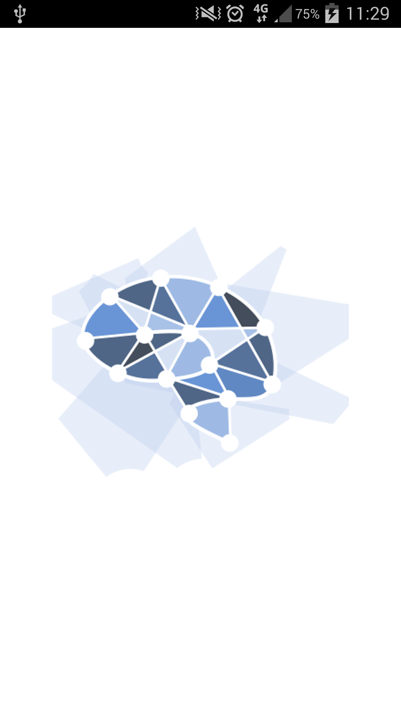
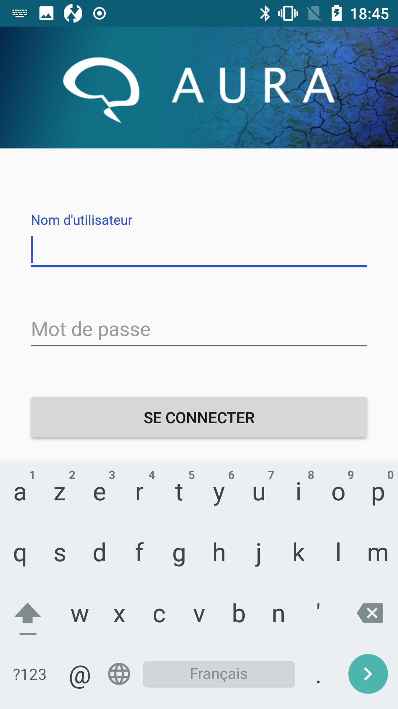
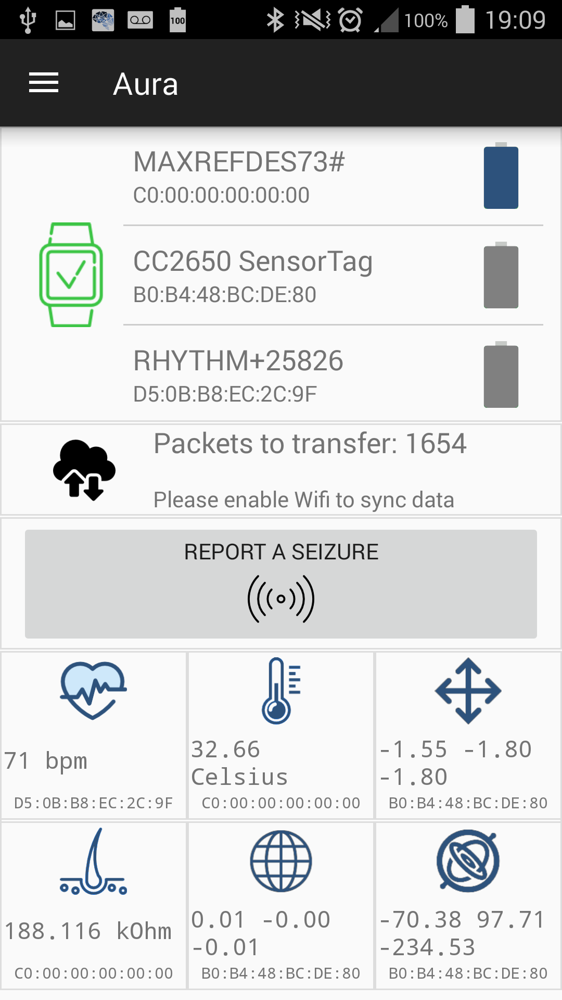
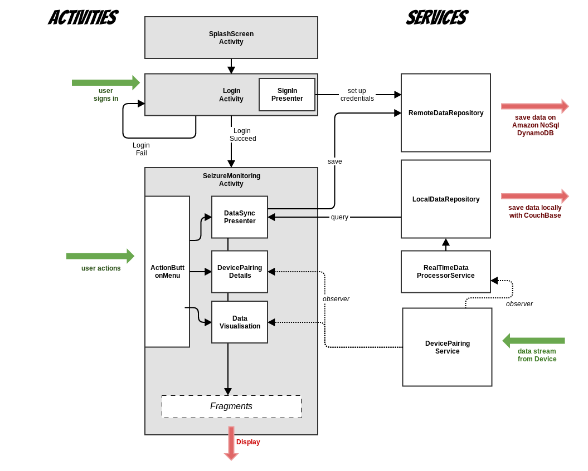

## Headline
The "Aura Project" app will alert an user from an epilepsy seizure within few minutes notice 

## Pre-requisites
1. Android Sdk version 25.0
2. Connected device transfering HRV data through Heart Rate bluetooth profile

## References

Android Architecture Blueprints
[link](https://github.com/googlesamples/android-architecture)

Nordic Semiconductor - puck-central-android - support multi BLE connection
[link](https://github.com/NordicSemiconductor/puck-central-android)

## How to contribute

We references all in-progress or future developpements on cards in [Github Project](https://github.com/clecoued/Aura_mobile_app/projects/1).


## User Experience

    


## App Architecture



## Details
The "Aura project" mobile application:

1. fetch physiological data from a armband device via Bluetooth Low Energy

2. process the data in order to anticipate an epilepsy seizure

3. alerts the user

# Generate Documentation #
```
cd rootProjectDir/documentation 
doxygen Doxyfile 
```
