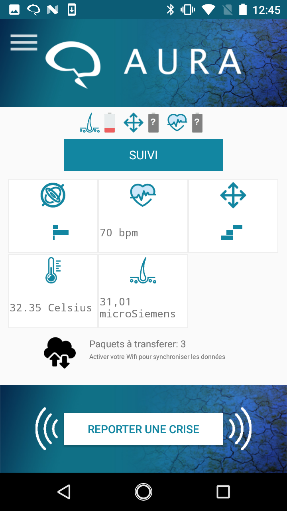

[](https://travis-ci.org/Aura-healthcare/Aura_mobile_app)
[](https://codecov.io/gh/Aura-healthcare/Aura_mobile_app)
[](https://sonarcloud.io/dashboard?id=Aura_mobile_app%3Aapp)
## Headline
The "Aura Project" app will alert an user from an epilepsy seizure within few minutes notice

## How to contribute

Please refer to [How To Contribute](https://github.com/Aura-healthcare/Aura_mobile_app/blob/master/CONTRIBUTING.md)

## Pre-requisites
1. Android Sdk version 25.0
2. Connected device transfering HRV data through Heart Rate bluetooth profile
3. Connected device - MaximIntegrated - MAXREFDES73# - Skin temperature / Electro dermal activity
4. Connected device - Motion sensor armwrist

## References

Android Architecture Blueprints
[link](https://github.com/googlesamples/android-architecture)

iDevicesInc - SweetBlue - support multi Bluetooth connection on most Android platforms and devices
[link](https://github.com/iDevicesInc/SweetBlue)

## User Experience

     


## App Architecture


## Details
The "Aura project" mobile application:

1. fetch physiological data from a armband device via Bluetooth Low Energy

2. process the data in order to anticipate an epilepsy seizure

3. alerts the user

# Generate Documentation #
```
cd rootProjectDir/documentation
doxygen Doxyfile
```

# How to run performances tests
In order to ensure best user experience, we implement few instrumented tests that will check that the big volume of data are saved and uploaded in a reasonable time.

## Prerequisites

 * Install a local **InfluxDB** server and
 * start the local **InfluxDB** server
   * create a *physio_signal* database
   * create a *test* user with *test* password
   * grant all acces to *test* user on *physio_signal* database


 * In DataPipelinePerfsInstrumentedTest file, set the proper end point for your *InfluxDB* database  
   * private String TEST_INFLUX_DB = "http://XXX.XXX.X.XX:8086";


## Tests execution
  * Remove the *@Ignore* flag from the tests you want to execute

  * Select the smartphone you want the tests to be executed on

  * run the DataPipelinePerfsInstrumentedTest
