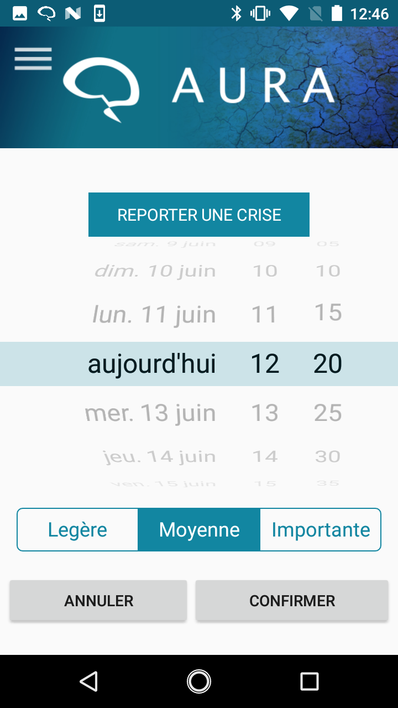

[](https://travis-ci.org/Aura-healthcare/Aura_mobile_app)
[](https://codecov.io/gh/Aura-healthcare/Aura_mobile_app)
## Headline
The "Aura Project" app will alert an user from an epilepsy seizure within few minutes notice

## Pre-requisites
1. Android Sdk version 25.0
2. Connected device transfering HRV data through Heart Rate bluetooth profile
3. Connected device - MaximIntegrated - MAXREFDES73# - Skin temperature / Electro dermal activity
4. Connected device - Motion sensor armwrist

## References

Android Architecture Blueprints
[link](https://github.com/googlesamples/android-architecture)

iDevicesInc - SweetBlue - support multi Bluetooth connection on most Android platforms and devices
[link](https://github.com/iDevicesInc/SweetBlue)

## How to contribute

We references all in-progress or future developpements on cards in [Github Project](https://github.com/clecoued/Aura_mobile_app/projects/1).


## User Experience

     


## App Architecture


## Details
The "Aura project" mobile application:

1. fetch physiological data from a armband device via Bluetooth Low Energy

2. process the data in order to anticipate an epilepsy seizure

3. alerts the user

# Generate Documentation #
```
cd rootProjectDir/documentation
doxygen Doxyfile
```
